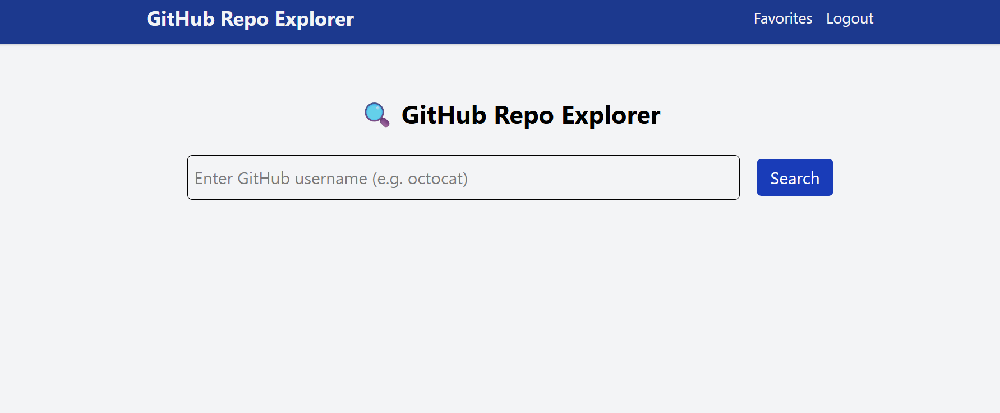
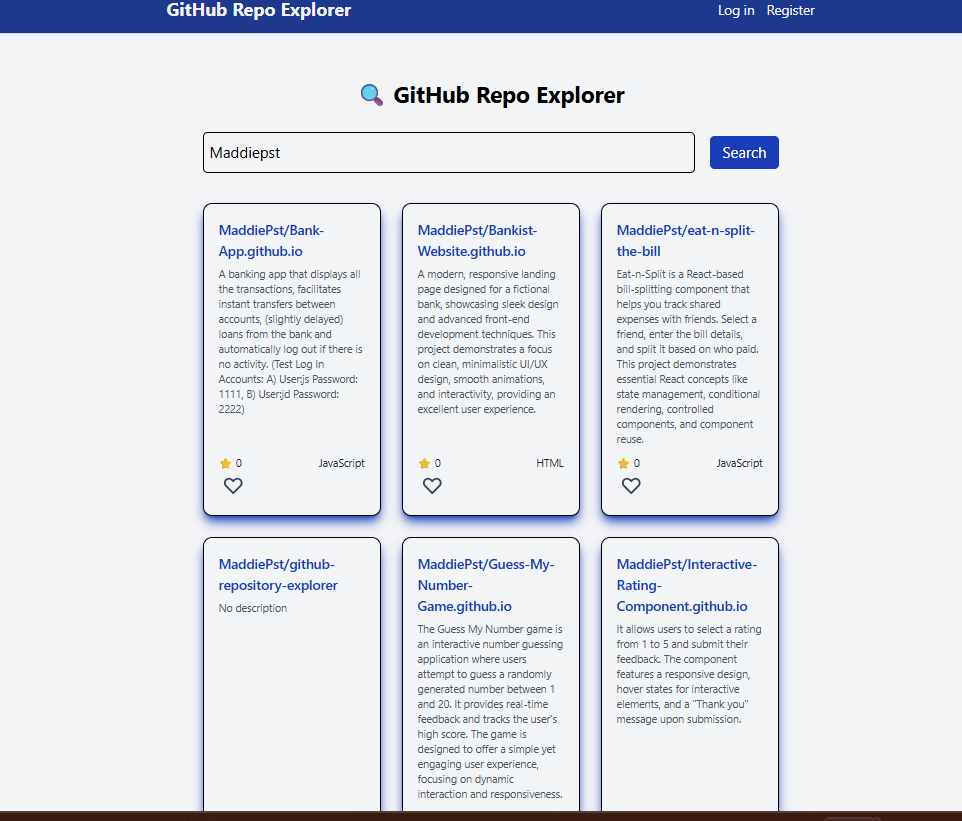
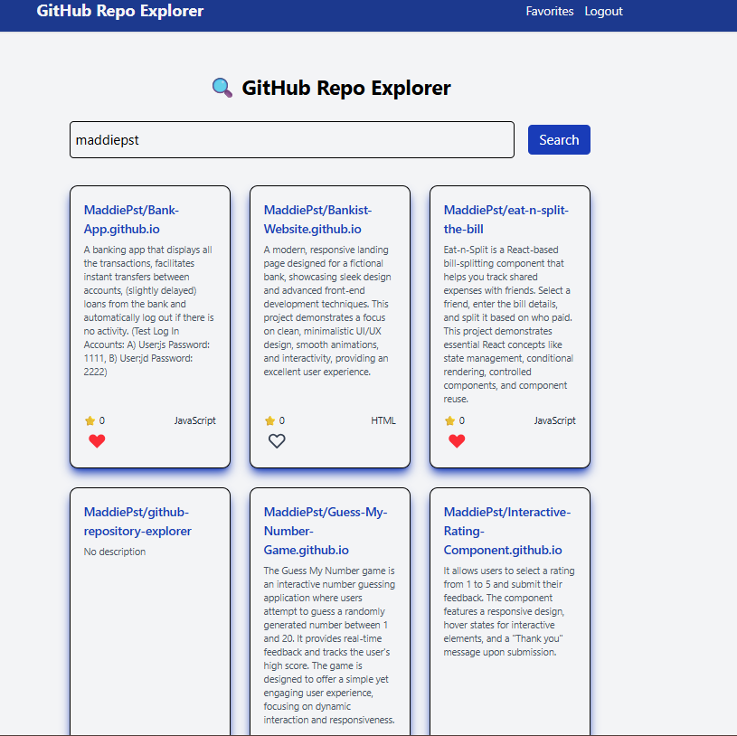

# GitHub Repository Explorer ⭐

A full-stack web application that allows users to search for GitHub repositories by username, explore repository details, and manage a personalized list of favorite repositories. The app integrates authentication, persistent favorites storage, and real-time UI updates for a seamless user experience.

## Table of contents

-[Overview](#overview)
  - [The challenge](#the-challenge)
  - [Key features](#key-features)
  - [Screenshots](#screenshots)
  - [Links](#links)
- [My process](#my-process)
  - [Built with](#built-with)
  - [Key Takeaway](#key-takeaway)
  - [Technologies Used](#technologies-used)
- [Author](#author)

## Overview

### The challenge
Users should be able to:
 - Search for any GitHub username and view their public repositories
 - See repository details such as name, description, stars, and language
 - Authenticate and manage a personal list of favorite repositories
 - Add or remove repositories from favorites using a heart icon
 - Have favorite repositories persist across sessions
 - Experience immediate UI feedback through optimistic updates
 - Access protected routes securely using authentication middleware

### ⭐ Key features
GitHub API Integration
  - Fetches live repository data directly from GitHub based on the searched username.
Authentication & Authorization
  - Secure login system with JWT-based authentication and protected backend routes.
Favorites System 
  - Favorites are stored in a Supabase database and linked to the authenticated user.
Merged Repository State
  - GitHub repositories are dynamically merged with user favorites so each repo knows whether it is favorited.
UI Updates
  - Heart icons update instantly while syncing with the backend for a smooth user experience.
Responsive Design
  - Clean, modern UI optimized for desktop and mobile screens.

### Screenshots

### Links
🔗 Live Demo:
https://github-repository-explorer-three.vercel.app/

## My process
### Built with
  - React + TypeScript
  - Vite
  - Tailwind CSS
  - React Hooks
  - Axios
  - Node.js & Express
  - Supabase
  - JWT Authentication
  - GitHub REST API
  - Render (Backend Deployment)
  - Vercel (Frontend Deployment)

### 🚀 Key takeaways

This project reflects a strong understanding of full-stack application architecture and real-world development workflows:

1. Full-Stack Data Flow
Designed a clear data flow between frontend, backend, third-party APIs (GitHub), and a relational database (Supabase).

2. Secure Authentication Patterns
Implemented JWT authentication with middleware to protect sensitive routes while allowing public access where appropriate.

3. Backend Data Merging
Combined external API data (GitHub repos) with internal user-specific data (favorites) to produce enriched responses.

4. Optimistic UI & State Synchronization
Applied optimistic updates to improve perceived performance while ensuring consistency with server state.

5. Custom React Hooks
Encapsulated business logic (favorites handling, API calls) into reusable hooks for cleaner components.

6. Error Handling & Edge Cases
Handled loading states, authorization errors, empty results, and API failures gracefully on both frontend and backend.

7. Production Deployment
Deployed a real-world full-stack application using modern hosting platforms (Render + Vercel), including environment variable management.

### 🛠️ Technologies used

Frontend: React, TypeScript, Vite, Tailwind CSS

Backend: Node.js, Express, JWT

Database: Supabase

APIs: GitHub REST API

Deployment: Vercel (Frontend), Render (Backend)

Tooling: Git, GitHub, VS Code

## Author

Portfolio: https://maddiepst.github.io/

LinkedIn: Madalina Pastiu

GitHub: @MaddiePst
